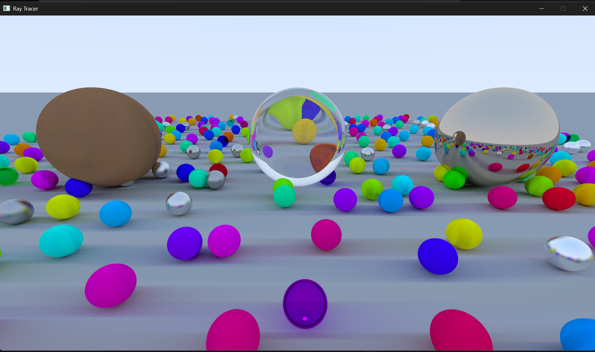

<h1 align="center">RayTracer</h1>

<p align="center">
  <em>A basic CPU ray tracer built with modern C++17, SDL3, and GLM.</em>
</p>

---

## 📌 Overview

This project is a **basic ray tracing system** written in modern **C++17**, using:

- **SDL3** for window creation and displaying pixels
- **GLM** for vector and matrix math
- A custom **CPU path tracer** with:
  - Multiple materials (Lambertian, Metal, Dielectric, Emissive)
  - Recursive reflections and refractions
  - Multi-sample anti-aliasing
  - Sky gradient background
  - Infinite ground plane and many randomized spheres

The code is structured around a small set of clear classes:

- `Camera` – generates rays for each pixel  
- `Scene` – stores objects and performs ray tracing  
- `Sphere` / `Plane` – geometric primitives  
- `Material` and derived types – control surface appearance  
- `Renderer` / `Framebuffer` – manage SDL rendering and pixel buffers  

---

## 🧱 Project Structure

```text
RayTracer/
├── Build/                 # Runtime DLL(s) (e.g., SDL3.dll)
├── Source/                # All C++ source files
│   ├── Camera.{h,cpp}
│   ├── Color.h
│   ├── Framebuffer.{h,cpp}
│   ├── Material.{h,cpp}
│   ├── Math.h
│   ├── Object.h
│   ├── Plane.{h,cpp}
│   ├── Random.h
│   ├── Ray.h
│   ├── Renderer.{h,cpp}
│   ├── Scene.{h,cpp}
│   ├── Sphere.{h,cpp}
│   ├── Transform.h
│   └── Main.cpp
├── ThirdParty/
│   ├── SDL3/              # SDL3 headers and libraries
│   └── glm/               # GLM math library
├── RayTracer.sln          # Visual Studio solution
├── RayTracer.vcxproj      # Project file
├── RayTracer.vcxproj.filters
└── README.md              # This file
```

---

## ✨ Features

### Rendering

* **CPU-based ray tracer / path tracer**

  * Recursive ray tracing with configurable max bounce depth (default: **7**)
  * Randomized hemisphere sampling for diffuse reflection
  * Glass / dielectric refraction with **Schlick**-style reflectance
* **Multi-sample anti-aliasing**

  * Default: **250 samples per pixel (spp)**
  * Jittered sampling within each pixel (stochastic AA)
* **Gradient sky background**

  * Blends between `skyBottom` and `skyTop` based on ray direction
  * Configurable via `Scene::SetSky`

### Geometry

* **Primitives**

  * `Sphere`
  * `Plane` (used as infinite ground plane)
* **Transform system (`Transform`)**

  * Position / rotation (quaternions) / scale
  * Helper functions for forward/up/right vectors
  * Matrix generation for transforms (even if not heavily used in this minimal ray tracer)

### Materials

Implemented in `Material.h` / `Material.cpp`:

* **`Lambertian`** – diffuse material
* **`Metal`** – reflective material with adjustable fuzziness
* **`Dielectric`** – glass/transparent material with IOR and Schlick reflectance
* **`Emissive`** – light-emitting material

Each material provides:

```cpp
bool Scatter(
    const ray_t& incident,
    const raycastHit_t& hit,
    color3_t& attenuation,
    ray_t& scattered
) const;
```

and optionally:

```cpp
color3_t GetEmissive() const;
```

### Scene Setup (Default)

In `Main.cpp`, the scene is created as:

* Infinite ground plane (Lambertian)
* A dense grid of small spheres with randomized positions and materials:

  * Diffuse spheres with random HSV colors
  * Metallic spheres with random albedo and fuzz
  * Glass spheres with tinted dielectric material
* Three larger “feature” spheres:

  * Center: glass (`Dielectric`)
  * Left: diffuse (Lambertian)
  * Right: metal (`Metal`)

The final render (shown below) is produced at **1920×1080**, **250 spp**, and a maximum recursion depth of **7 bounces**.

---

## 🛠️ Building

### Prerequisites

* **Operating System:** Windows 10/11
* **Compiler/IDE:** Visual Studio 2019 or 2022 (**x64**)
* **No external installs required** if using the provided `ThirdParty` folder:

  * `SDL3` (in `ThirdParty/SDL3`)
  * `glm` (in `ThirdParty/glm`)

### Steps

1. Open `RayTracer.sln` in **Visual Studio**.
2. Select:

   * **Configuration:** `Debug` or `Release`
   * **Platform:** `x64`
3. Build with **Build → Build Solution** or `Ctrl + Shift + B`.

> ⚠️ If the generated executable cannot find `SDL3.dll`, ensure a copy of `SDL3.dll` from the `Build/` folder is placed next to your built `.exe` (or add `Build/` to your PATH or working directory setup).

---

## ▶️ Running

### From Visual Studio

1. Set the **RayTracer** project as the Startup Project.
2. In Project Properties → **Debugging**, set **Working Directory** to the folder where your executable and `SDL3.dll` live (commonly `$(SolutionDir)x64\Debug` or `$(SolutionDir)x64\Release`).
3. Press **F5** (run with debugger) or **Ctrl+F5** (run without debugger).

### From Command Line / Explorer

1. Locate the built executable (e.g. `x64/Release/RayTracer.exe`).
2. Make sure `SDL3.dll` is in the same folder or in your PATH (you can copy it from `Build/`).
3. Run the executable:

```bash
RayTracer.exe
```

The program:

* Opens an SDL window (default **1920×1080**)
* Performs the ray tracing render once
* Displays the final image and keeps the window open until you close it

---

## 🎮 Controls

The ray tracer renders a **single still frame** and does not currently support interactive camera movement.

* Close the window using the OS window close button
* Press **Escape** (`Esc`) to exit

Camera position and target are set in `Main.cpp`:

```cpp
float aspectRatio = framebuffer.width / (float)framebuffer.height;
Camera camera(70.0f, aspectRatio);
camera.SetView({ 0, 2, 5 }, { 0, 0, 0 }); // eye, target
```

Adjust these values to change the view.

---

## ⚙️ Technical Details

### Core Classes

* **`Renderer`** – wraps SDL initialization, window creation, and `SDL_Renderer`, and presents the framebuffer
* **`Framebuffer`** – CPU pixel buffer + streaming texture update to SDL
* **`Camera`** – computes view rays using a pinhole camera model
* **`Scene`** – stores objects and implements the recursive `Trace` function
* **`Sphere` / `Plane`** – geometric primitives implementing intersection logic
* **`Material`** – base class for shading behavior

### Rendering Algorithm

Inside `Scene::Render`:

```cpp
for (int y = 0; y < framebuffer.height; y++) {
    for (int x = 0; x < framebuffer.width; x++) {
        color3_t color{ 0 };

        for (int i = 0; i < numSamples; i++) {
            glm::vec2 pixel{ x, y };
            pixel += glm::vec2{ random::getReal(), random::getReal() }; // jitter
            glm::vec2 point = pixel / glm::vec2{ framebuffer.width, framebuffer.height };
            point.y = 1 - point.y; // flip Y

            ray_t ray = camera.GetRay(point);
            color += Trace(ray, 1e-3f, 100.0f, 7); // 7 bounces
        }

        color = GetAverageColor(color, numSamples);
        framebuffer.DrawPoint(x, y, ColorConvert(color));
    }
}
```

Key aspects:

* **Anti-aliasing:** 250 jittered samples per pixel
* **Max recursion depth:** 7 bounces per ray
* Small epsilon offset to prevent self-intersection artifacts

### `Trace` Function

* Find nearest intersection among all objects
* If hit:

  * Ask material to **scatter** ray (or emit light)
  * Recursively trace scattered ray and apply attenuation
* If no hit:

  * Return gradient sky color:

```cpp
glm::vec3 direction = glm::normalize(ray.direction);
float t = (direction.y + 1) * 0.5f;
color3_t color = glm::mix(skyBottom, skyTop, t);
```

---

## 🎨 Visual Showcase

> Save the screenshot you shared into your repository (for example at `docs/images/raytracer_250spp_7bounces.png`) and ensure the path below matches.

<p align="center">
  
  <br/>
  <em>Ray-traced image rendered at 1920×1080, 250 samples per pixel, maximum depth 7 bounces.</em>
</p>

---

## 📚 Attribution

### Libraries

This project uses:

* **SDL3** – windowing, input, and rendering
* **GLM** – math library for vectors, matrices, and color conversions

Both are included under the `ThirdParty/` directory. Refer to each library’s own license files or official repositories for detailed terms.

---

## ✅ Summary

This ray tracer is a compact, self-contained example of:

* CPU-based ray tracing / path tracing in modern C++
* Multi-sample anti-aliasing (250 spp)
* Recursive reflections and refractions (up to 7 bounces)
* A lightweight material and scene system

It’s a solid starting point for experimenting with:

* New primitives (boxes, meshes)
* More advanced BRDFs and texturing
* Area lights and global illumination tricks
* Multi-threading / tiling for faster renders

Have fun bending rays. 🔦✨

---

## Copyright

© **2025 Cody Owens**
All rights reserved.

README authored with assistance from **ChatGPT (GPT-5.1 Thinking)** by OpenAI.

Third-party libraries and assets are the property of their respective owners and are used under their own licenses.
